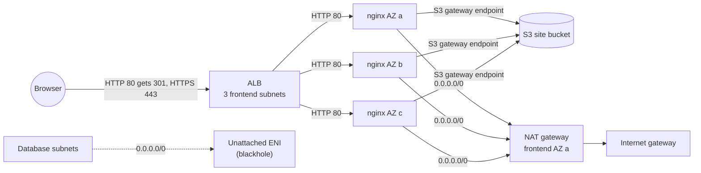

# Assessment 1: Highly available nginx on AWS with Terraform

A three-tier VPC across three Availability Zones, an Application Load Balancer that terminates TLS, three private nginx instances that pull a static site from S3, and an isolated database tier whose default route is a deliberate blackhole. Everything is built with Terraform, written on Windows, versioned in GitHub and applied from an EC2 workstation.

**Contents**

1. [Architecture](#1-architecture)
2. [How the work flows](#2-how-the-work-flows)
3. [Repository layout](#3-repository-layout)
4. [One-time setup](#4-one-time-setup)
5. [Quick start: deploy, test, destroy](#5-quick-start-deploy-test-destroy)
6. [Step-by-step build log](#6-step-by-step-build-log)
7. [Day-to-day operations](#7-day-to-day-operations)
8. [Variables](#8-variables)
9. [Outputs](#9-outputs)
10. [Verification checklist](#10-verification-checklist)
11. [Troubleshooting](#11-troubleshooting)
12. [Security notes](#12-security-notes)
13. [Cost notes](#13-cost-notes)
14. [Next: Ansible over SSM](#14-next-ansible-over-ssm)

---

## 1. Architecture



One VPC (`10.0.0.0/16`) spans three AZs. Each AZ has one frontend, one backend and one database subnet (9 in total), and each tier shares one route table (3 in total).

### Subnet and routing plan

| Tier | AZ a | AZ b | AZ c | Route table | Default route (`0.0.0.0/0`) | What lives here |
|---|---|---|---|---|---|---|
| Frontend (public) | `10.0.1.0/24` | `10.0.2.0/24` | `10.0.3.0/24` | `rt-frontend` | Internet gateway | ALB, NAT gateway |
| Backend (private) | `10.0.11.0/24` | `10.0.12.0/24` | `10.0.13.0/24` | `rt-backend` | NAT gateway (S3 goes through the gateway endpoint) | 3 nginx instances |
| Database (isolated) | `10.0.21.0/24` | `10.0.22.0/24` | `10.0.23.0/24` | `rt-database` | Blackhole (traffic dropped) | Reserved for a future RDS database |

Every route table also has the implicit local route for `10.0.0.0/16`, so all tiers can reach each other inside the VPC. Security groups decide who actually may.

### How a request flows

1. A browser hits the ALB on port 80. The listener answers with a **301 redirect** to `https://`.
2. The browser reconnects on port 443. TLS ends at the ALB, which forwards plain HTTP to a healthy instance on port 80 through the target group.
3. Each instance downloads the website from S3 at boot and every 5 minutes, using its IAM role (no keys).
4. Instances reach the internet (apt packages, Systems Manager) through the NAT gateway. Nothing on the internet can reach them directly.
5. Anything in a database subnet that tries to reach `0.0.0.0/0` hits the blackhole route and is dropped.

### Design decisions

- **EC2 in private subnets.** Instances get no public IP. Only the ALB's security group may reach port 80.
- **One NAT gateway** (in AZ a), because there is one backend route table. If AZ a fails, all instances lose outbound access. Production would use one NAT gateway and one backend route table per AZ.
- **The blackhole.** VPC route tables have no "blackhole" target type. A route whose target cannot forward traffic shows the state *blackhole* and silently drops packets. The database default route points at a network interface (ENI) that is never attached. It is free, declarative and destroys cleanly.
- **TLS certificate.** Without a domain, Terraform generates a self-signed certificate with the `tls` provider and imports it into ACM, so browsers show a warning. Setting `acm_certificate_arn` swaps in a real certificate.
- **S3 access without keys.** An IAM role with read-only access to the site bucket is attached through an instance profile. A free S3 gateway endpoint keeps that traffic inside AWS and off the NAT bill.
- **No SSH.** Instances are managed through Systems Manager (SSM) Session Manager. Port 22 is never opened.
- **Bootstrapping.** By default, EC2 user data installs nginx and syncs the site, so one `apply` gives a working stack. Set `bootstrap_with_user_data = false` to leave that job to Ansible instead.

---

## 2. How the work flows

```
Windows (VS Code + Git Bash)  →  git push  →  GitHub  →  git pull  →  EC2 workstation (terraform)  →  AWS
```

Three rules keep this simple:

1. **Edit files only on Windows.** Editing on the EC2 workstation causes conflicts on the next `git pull`.
2. **Run `terraform` only on the EC2 workstation**, always from the repo root (`~/assesement-1`), never from a subfolder.
3. **State never goes into git.** It lives in an encrypted, versioned S3 bucket (see [Step 12](#step-12-remote-state-in-s3)). `.gitignore` blocks local state files as a safety net.

---

## 3. Repository layout

Terraform reads every `.tf` file in the folder it runs from, so files are split by area. File names don't matter to Terraform; they're for humans.

| Path | What it holds |
|---|---|
| `versions.tf` | Required Terraform version and providers (`aws`, `tls`) |
| `backend.tf` | Remote state in S3 |
| `providers.tf` | AWS region and default tags applied to every resource |
| `variables.tf` | Declared inputs |
| `terraform.tfvars` | Values for those inputs |
| `locals.tf` | Name prefix, common tags, the 3 AZs |
| `data.tf` | Lookups: current account, available AZs |
| `network.tf` | VPC, internet gateway, 9 subnets |
| `routing.tf` | NAT gateway and Elastic IP, blackhole ENI, 3 route tables, 9 associations, S3 gateway endpoint |
| `security.tf` | ALB and app security groups with their rules |
| `s3.tf` | Site bucket, public access block, upload of `site/` |
| `iam.tf` | Instance role (SSM + read site bucket) and instance profile |
| `compute.tf` | Ubuntu 24.04 AMI lookup and the 3 nginx instances |
| `tls.tf` | Self-signed certificate imported into ACM (optional) |
| `alb.tf` | ALB, target group, attachments, HTTP and HTTPS listeners |
| `outputs.tf` | Values printed after `apply` |
| `scripts/user_data.sh.tftpl` | First-boot script: nginx, AWS CLI, S3 sync, 5-minute cron |
| `site/` | The static website (`index.html` and anything else) |
| `.gitignore` | Keeps state files and `.terraform/` out of git |
| `.gitattributes` | Forces Linux (LF) line endings so scripts run on EC2 |
| `tf-skeleton/` | The original blank templates. No longer needed; remove with `git rm -r tf-skeleton` |

---

## 4. One-time setup

### 4.1 Windows (editing machine)

1. Install **Git for Windows** (includes Git Bash and Git Credential Manager) and **VS Code** with the **HashiCorp Terraform** extension.
2. In VS Code, press **Ctrl+Shift+P → Terminal: Select Default Profile → Git Bash**.
3. Configure git and clone the repo:

   ```bash
   git config --global user.name "Your Name"
   git config --global user.email "you@example.com"
   git config --global credential.helper manager

   cd ~/Documents
   git clone https://github.com/gautham1986/assesement-1.git
   cd assesement-1
   ```

4. Make sure Linux line endings are enforced (already committed in this repo):

   ```bash
   echo "* text=auto eol=lf" > .gitattributes
   ```

5. **GitHub sign-in.** GitHub doesn't accept account passwords for `git push`. On the first push, choose **Sign in with your browser** in the pop-up. If that fails, create a fine-grained personal access token (**Settings → Developer settings → Personal access tokens → Fine-grained tokens**) limited to this repo with **Contents: Read and write**, and paste it as the password.

### 4.2 EC2 workstation (Ubuntu, runs Terraform)

1. **Install Terraform** (HashiCorp apt repository) and the AWS CLI:

   ```bash
   wget -O - https://apt.releases.hashicorp.com/gpg | sudo gpg --dearmor -o /usr/share/keyrings/hashicorp-archive-keyring.gpg
   echo "deb [arch=$(dpkg --print-architecture) signed-by=/usr/share/keyrings/hashicorp-archive-keyring.gpg] https://apt.releases.hashicorp.com $(lsb_release -cs) main" | sudo tee /etc/apt/sources.list.d/hashicorp.list
   sudo apt update && sudo apt install -y terraform git
   sudo snap install aws-cli --classic

   terraform -version   # must be 1.10 or newer
   ```

2. **Attach an IAM role to the workstation** (EC2 console → select instance → **Actions → Security → Modify IAM role**). Terraform uses this role; no access keys are stored anywhere. It needs permissions for VPC/EC2, Elastic Load Balancing, S3, IAM, ACM and SSM. In a personal lab account, `AdministratorAccess` is the simplest choice. Check it:

   ```bash
   aws sts get-caller-identity
   ```

3. **Clone the repo with a read-only token.** Create a second fine-grained token for this repo with **Contents: Read-only**. The workstation only pulls, never pushes.

   ```bash
   cd ~
   git config --global credential.helper store   # saves the token in plain text; acceptable because it is read-only
   git clone https://github.com/gautham1986/assesement-1.git
   cd assesement-1
   ```

### 4.3 State bucket (one time, by hand)

The bucket that holds Terraform's state is **not** managed by this code. Otherwise `terraform destroy` would delete its own state.

```bash
ACCOUNT_ID=$(aws sts get-caller-identity --query Account --output text)
REGION="eu-north-1"
BUCKET="assessment-1-tfstate-${ACCOUNT_ID}"

aws s3api create-bucket --bucket "$BUCKET" --region "$REGION" \
  --create-bucket-configuration LocationConstraint="$REGION"

aws s3api put-bucket-versioning --bucket "$BUCKET" \
  --versioning-configuration Status=Enabled

aws s3api put-public-access-block --bucket "$BUCKET" \
  --public-access-block-configuration BlockPublicAcls=true,IgnorePublicAcls=true,BlockPublicPolicy=true,RestrictPublicBuckets=true

echo "$BUCKET"
```

The printed name must match `bucket` in `backend.tf`. In `us-east-1`, leave out the `--create-bucket-configuration` line.

---

## 5. Quick start: deploy, test, destroy

On the EC2 workstation:

```bash
cd ~/assesement-1
git pull
terraform init
terraform validate
terraform plan        # expect: Plan: 55 to add, 0 to change, 0 to destroy
terraform apply       # type yes; takes about 5–8 minutes (NAT gateway and ALB are the slow parts)
```

**Test** (wait about a minute after `apply` for health checks to pass):

```bash
DNS=$(terraform output -raw alb_dns_name)
curl -sI http://$DNS | head -n 3    # expect: HTTP/1.1 301 Moved Permanently, Location: https://...
curl -sk https://$DNS               # expect: your index.html (-k accepts the self-signed certificate)
terraform output -raw alb_url       # open this in a browser; choose Advanced → Proceed past the warning
```

**Tear down** when you stop for the day:

```bash
terraform destroy     # type yes; expect: Destroy complete! Resources: 55 destroyed.
```

Then stop (don't terminate) the workstation from the EC2 console.

---

## 6. Step-by-step build log

This is the order the project was built in. Each step was small enough to check with `plan` and `apply` before moving on.

### The loop used for every step

**On Windows (Git Bash, repo root):**

```bash
# edit or create files in VS Code, then:
git add -A
git commit -m "Step N: description"
git push
```

**On the EC2 workstation:**

```bash
cd ~/assesement-1
git pull
terraform init        # only needed after adding a provider or changing the backend
terraform validate
terraform plan        # read the summary line before applying
terraform apply
```

Rules of thumb:

- `plan` showing only `to add` for a new step is expected.
- `plan` showing `destroy` or `must be replaced` when you didn't intend it means **stop and investigate**.
- A finished file goes in the **repo root**. Terraform ignores subfolders.

### Summary

| Step | Files | Creates | Resources |
|---|---|---|---|
| 1 | `versions.tf` | Terraform and AWS provider versions | 0 |
| 2 | `providers.tf` | AWS region | 0 |
| 3 | `data.tf`, `outputs.tf` | Account lookup and outputs (login check) | 0 |
| 4 | `variables.tf`, `terraform.tfvars`, `locals.tf` | Inputs, name prefix, default tags | 0 |
| 5 | `network.tf` | VPC, internet gateway, 9 subnets | 11 |
| 6 | `routing.tf` | NAT gateway + EIP, blackhole ENI, 3 route tables, 9 associations, S3 endpoint | 16 |
| 7 | `security.tf` | 2 security groups, 6 rules | 8 |
| 8 | `s3.tf`, `iam.tf`, `site/` | Site bucket + upload, instance role and profile | 7 |
| 9 | `compute.tf`, `scripts/` | 3 nginx instances | 3 |
| 10 | `tls.tf` | Private key, self-signed cert, ACM import | 3 |
| 11 | `alb.tf` | ALB, target group, 3 attachments, 2 listeners | 7 |
| 12 | `backend.tf` | State moved to S3 | 0 |
| | | **Total** | **55** |

### Step 1: Versions

**File:** `versions.tf`. Pins Terraform `>= 1.10.0` and the AWS provider `~> 6.0`.

**Verify:** `terraform init` ends with *Terraform has been successfully initialized!* and installs `hashicorp/aws v6.x`.

**Concept:** `~> 6.0` allows any 6.x version but never 7.0, so a major upgrade can't surprise you.

### Step 2: Provider

**File:** `providers.tf`. Configures the `aws` provider's region. No keys: the provider uses the workstation's IAM role.

**Verify:** `terraform plan` → *No changes.*

### Step 3: First lookup and first apply

**Files:** `data.tf` (`aws_caller_identity`), `outputs.tf` (`account_id`, `caller_arn`).

**Verify:** `plan` shows the two outputs with real values, which proves Terraform can log in to AWS. `apply` creates nothing and saves the outputs. `caller_arn` should mention `assumed-role` and the workstation's role.

**Concepts:**
- A **data source** (`data "..." "..."`) only reads.
- Reference pattern: `data.<type>.<name>.<attribute>`.

### Step 4: Variables and locals

**Files:**
- `variables.tf` declares `region`, `project` and `environment`.
- `terraform.tfvars` sets their values.
- `locals.tf` builds `name_prefix` (`assessment-1-dev`) and `common_tags`.
- `providers.tf` now uses `var.region` and `default_tags { tags = local.common_tags }`.

**Verify:** `plan` → *No changes.* If it prompts `var.region Enter a value`, `terraform.tfvars` is not in the repo root.

**Concepts:**
- `var.x` reads an input. `local.x` reads a computed value.
- `default_tags` stamps `Project`, `Environment` and `ManagedBy` onto every resource automatically.

### Step 5: VPC, internet gateway, subnets

**Files:**
- `network.tf`.
- Additions to `variables.tf` and `terraform.tfvars` (VPC and subnet CIDRs).
- `data.tf` (`aws_availability_zones`).
- `locals.tf` (`azs` = first 3 AZs).

**Creates:** 11 resources (1 VPC with DNS support and hostnames enabled, 1 internet gateway, 3 + 3 + 3 subnets).

**Verify:** VPC console → Subnets shows 9 subnets named like `assessment-1-dev-frontend-eu-north-1a`.

**Concepts:**
- Resource references use `<type>.<name>.<attribute>` (no `data.` prefix). Terraform orders creation from these references.
- `count = 3` makes three copies. `count.index` (0, 1, 2) picks the matching CIDR and AZ.

### Step 6: Routing

**File:** `routing.tf`.

**Creates:** 16 resources:
- Elastic IP
- NAT gateway in frontend AZ a
- Never-attached ENI in database AZ a
- `rt-frontend` (→ internet gateway), `rt-backend` (→ NAT gateway), `rt-database` (→ ENI, blackhole)
- 9 route table associations
- S3 gateway endpoint attached to `rt-backend`

**Verify:** VPC console → Route tables:

| Route table | `0.0.0.0/0` target | Status |
|---|---|---|
| `rt-frontend` | `igw-...` | Active |
| `rt-backend` | `nat-...` | Active (plus a `pl-...` route through `vpce-...` for S3) |
| `rt-database` | `eni-...` | **Blackhole** |

**Concepts:**
- `aws_subnet.frontend[0]` selects one copy from a `count` list.
- `depends_on` declares an ordering Terraform can't infer (NAT needs the internet gateway).

**Cost starts here:** the NAT gateway and Elastic IP are billed by the hour.

### Step 7: Security groups

**File:** `security.tf`.

**Creates:** 8 resources:

| Group | Direction | Rule |
|---|---|---|
| `alb-sg` | Inbound | 80 and 443 from `0.0.0.0/0` |
| `alb-sg` | Outbound | 80 to `app-sg` only |
| `app-sg` | Inbound | 80 from `alb-sg` only |
| `app-sg` | Outbound | 443 and 80 to `0.0.0.0/0` (S3, SSM, apt) |

No rule anywhere opens port 22.

**Verify:** EC2 console → Security Groups → `app-sg` has one inbound rule whose source is `sg-...` (the ALB group).

**Concepts:**
- Each rule is its own resource (`aws_vpc_security_group_ingress_rule` / `egress_rule`), so the two groups can reference each other without a dependency loop.
- `referenced_security_group_id` allows traffic from anything wearing that security group, regardless of IP address.
- Terraform removes AWS's default allow-all outbound rule, so every outbound rule is deliberate.

### Step 8: Site bucket and instance role

**Files:** `s3.tf`, `iam.tf`, `site/index.html`, plus a `site_bucket` output.

**Creates:** 7 resources (more if `site/` has more files):
- Bucket `assessment-1-dev-site-<account-id>` with `force_destroy = true`
- Public access block
- One `aws_s3_object` per file in `site/`
- Role `assessment-1-dev-app-role`
- `AmazonSSMManagedInstanceCore` attachment
- Inline `site-read` policy (`s3:ListBucket` on the bucket, `s3:GetObject` on its objects)
- Instance profile

**Verify:**
- The S3 console shows `index.html` in the bucket.
- IAM → Roles → the app role has both permissions.

**Concepts:**
- `for_each = fileset(...)` makes one upload per file. `etag = filemd5(...)` re-uploads a file when its content changes.
- `count` copies are numbered; `for_each` copies are named.
- `aws_iam_policy_document` builds policy JSON without hand-written brackets.

### Step 9: nginx instances

**Files:**
- `compute.tf`.
- `scripts/user_data.sh.tftpl`.
- `variables.tf` / `terraform.tfvars` (`instance_type = "t3.micro"`, `bootstrap_with_user_data = true`).
- An `instance_ids` output.

**Creates:** 3 Ubuntu 24.04 instances, one per backend subnet, with:
- no public IP
- IMDSv2 required
- an encrypted gp3 root volume
- the instance profile
- a `Role = nginx` tag

**The first-boot script:**
1. Installs nginx.
2. Installs the AWS CLI snap.
3. Runs `aws s3 sync s3://<bucket> /var/www/html --delete --region <region>`.
4. Writes `/etc/cron.d/site-sync` to repeat that sync every 5 minutes.

**Verify:** EC2 console → select an instance → **Connect → Session Manager → Connect**, then:

```bash
sudo tail -n 5 /var/log/cloud-init-output.log   # ends with "Cloud-init ... finished", no errors
curl -s localhost                               # prints index.html
cat /etc/cron.d/site-sync                       # shows the */5 sync
```

**Concepts:**
- `templatefile()` fills `${bucket}` and `${region}` into the script.
- `condition ? a : b` lets `bootstrap_with_user_data = false` skip the script.
- `user_data_replace_on_change = true` rebuilds instances when the script changes, because user data only runs on first boot.
- `lifecycle { ignore_changes = [ami] }` stops a newly published Ubuntu image from triggering a rebuild.
- `--region` on the sync makes the CLI use the regional S3 endpoint, so traffic goes through the free gateway endpoint instead of the NAT.
- `aws_instance.app[*].id` (splat) collects every copy's ID into a list.

### Step 10: TLS certificate

**Files:**
- `tls.tf`.
- `versions.tf` gains the `hashicorp/tls ~> 4.0` provider.
- `variables.tf` gains `acm_certificate_arn` (default `""`).
- A `certificate_arn` output.

**Creates:** 3 resources: an RSA 2048 private key, a 1-year self-signed certificate, and its import into ACM.

**Verify:**
- `terraform init` installs `hashicorp/tls`. Required, because a provider was added.
- ACM console shows the certificate as **Imported**, status **Issued**.

**Concepts:**
- `count = condition ? 1 : 0` makes a resource optional. The single copy is referenced with `[0]`.
- `local.certificate_arn` picks the real certificate if one is given, otherwise the self-signed one.
- `create_before_destroy` keeps the listener from ever being left without a certificate.

### Step 11: Load balancer

**File:** `alb.tf`, plus `alb_dns_name` and `alb_url` outputs.

**Creates:** 7 resources:
- An internet-facing ALB across the 3 frontend subnets.
- A target group on HTTP 80. Its health check runs on `/`, expects `200`, and checks every 15 seconds: 2 passes mark a target healthy, 3 failures mark it unhealthy.
- 3 target attachments.
- An HTTP 80 listener (301 to HTTPS).
- An HTTPS 443 listener (`ELBSecurityPolicy-TLS13-1-2-2021-06`, forwards to the target group).

**Verify:** see [Quick start](#5-quick-start-deploy-test-destroy). EC2 console → Target Groups → Targets shows all 3 **healthy**.

### Step 12: Remote state in S3

**File:** `backend.tf`:

```hcl
terraform {
  backend "s3" {
    bucket       = "assessment-1-tfstate-<account-id>"
    key          = "assessment-1/dev/terraform.tfstate"
    region       = "eu-north-1"
    encrypt      = true
    use_lockfile = true
  }
}
```

**One-time migration** (after creating the bucket in [4.3](#43-state-bucket-one-time-by-hand)):

```bash
terraform init -migrate-state      # answer yes to copy the existing state
terraform plan                     # must say: No changes.
aws s3 ls s3://assessment-1-tfstate-<account-id>/assessment-1/dev/
mv terraform.tfstate terraform.tfstate.pre-s3-backup 2>/dev/null
```

**Concepts:**
- A backend block can't use `var.` or `local.`; its values are typed in directly.
- `use_lockfile` (Terraform 1.10+) prevents two runs from changing state at once.
- The state contains the certificate's private key, which is why it lives in an encrypted bucket and never in git.

---

## 7. Day-to-day operations

| Task | How |
|---|---|
| Start a session | Start the workstation → `cd ~/assesement-1 && git pull && terraform apply` |
| End a session | `terraform destroy` → stop the workstation |
| Change infrastructure | Edit on Windows → push → on EC2: `git pull`, `terraform plan`, `terraform apply` |
| Update the website | Edit files in `site/` → push → on EC2: `git pull`, `terraform apply`. Instances pick up the change within 5 minutes. |
| Use a real certificate | Set `acm_certificate_arn = "arn:aws:acm:..."` in `terraform.tfvars` → apply. The self-signed resources are destroyed and the listener switches. |
| Hand bootstrapping to Ansible | Set `bootstrap_with_user_data = false` → apply. This **replaces the 3 instances**, because their user data changes. |
| Added a provider or changed the backend | Run `terraform init` before `plan` |
| Inspect results | `terraform output`, `terraform state list` |

---

## 8. Variables

| Name | Type | Default | Value in `terraform.tfvars` | Purpose |
|---|---|---|---|---|
| `region` | string | none | `eu-north-1` | AWS region |
| `project` | string | none | `assessment-1` | Used in names and tags |
| `environment` | string | none | `dev` | Used in names and tags |
| `vpc_cidr` | string | none | `10.0.0.0/16` | VPC range |
| `frontend_subnet_cidrs` | list(string) | none | `10.0.1-3.0/24` | Public subnets |
| `backend_subnet_cidrs` | list(string) | none | `10.0.11-13.0/24` | Private subnets |
| `database_subnet_cidrs` | list(string) | none | `10.0.21-23.0/24` | Isolated subnets |
| `instance_type` | string | none | `t3.micro` | nginx instance size |
| `bootstrap_with_user_data` | bool | `true` | `true` | `false` hands setup to Ansible |
| `acm_certificate_arn` | string | `""` | not set | Empty means self-signed |

## 9. Outputs

| Name | Example | Meaning |
|---|---|---|
| `account_id` | `123456789012` | AWS account in use |
| `caller_arn` | `arn:aws:sts::...:assumed-role/<role>/i-...` | Identity Terraform runs as |
| `site_bucket` | `assessment-1-dev-site-123456789012` | Bucket holding the website |
| `instance_ids` | `["i-...", "i-...", "i-..."]` | The 3 nginx instances |
| `certificate_arn` | `arn:aws:acm:...` | Certificate on the HTTPS listener |
| `alb_dns_name` | `assessment-1-dev-alb-....elb.amazonaws.com` | Load balancer address |
| `alb_url` | `https://assessment-1-dev-alb-...` | Open in a browser |

---

## 10. Verification checklist

- [ ] VPC console: 1 VPC, 9 subnets, 3 route tables
- [ ] `rt-database` default route shows **Blackhole**
- [ ] `rt-backend` has a `pl-...` (S3) route through `vpce-...`
- [ ] `app-sg` inbound: only port 80 from `alb-sg`; no port 22 anywhere
- [ ] Instances have no public IPv4 address
- [ ] Session Manager connects to each instance
- [ ] `curl -sI http://<alb>` returns `301` to `https://`
- [ ] `curl -sk https://<alb>` returns the site
- [ ] Target group: 3 / 3 healthy
- [ ] ACM: certificate Imported / Issued
- [ ] `terraform destroy` reports 55 destroyed

---

## 11. Troubleshooting

These are the problems hit while building this project, and their fixes.

| Symptom | Cause | Fix |
|---|---|---|
| `There is no backend type named "BACKEND_TYPE"` / `PROVIDER_NAME is an invalid provider local name` | Terraform was run inside `tf-skeleton/`, which still holds unfilled templates | `cd ~/assesement-1` (the prompt must end in `assesement-1$`) |
| `Missing newline after argument` on `PROVIDER_NAME = aws{` | The value was typed next to the placeholder instead of replacing it | The line must read `aws = {` |
| `Terraform initialized in an empty directory!` | The `.tf` file is still in a subfolder | On Windows: `git mv tf-skeleton/<file> .` → commit → push → pull on EC2 |
| `git pull` says *Already up to date* but changes are missing | The Windows commit or push didn't happen | On Windows: `git status`, `git log --oneline -3`, `git push` |
| `Password authentication is not supported for Git operations` | GitHub no longer accepts account passwords | Browser sign-in via `credential.helper manager`, or a personal access token |
| `git pull` refuses because of local changes | A file was edited on the EC2 workstation | `git restore .` then `git pull` (Windows is the source of truth) |
| `plan` prompts `var.<name> Enter a value` | `terraform.tfvars` missing from the repo root, or the variable isn't set in it | Check `ls`; add the value |
| `No valid credential sources found` | Workstation has no IAM role | Attach one: **Actions → Security → Modify IAM role** |
| `AccessDenied` on `iam:CreateRole`, `s3:CreateBucket`, etc. | Workstation role lacks permissions | Add the missing permissions (lab: `AdministratorAccess`) |
| `Inconsistent dependency lock file` or provider not found | A provider was added (e.g. `tls`) | `terraform init` |
| Browser shows **502 Bad Gateway** | No healthy targets yet, or nginx failed on the instances | Check Target Groups → Targets → *Health status details* (below) |
| Session Manager says the instance isn't connected | SSM agent hasn't registered yet | Wait 2–3 minutes. It needs the NAT route and the SSM policy. |

**Reading target health details:**

| Shows | Meaning | Fix |
|---|---|---|
| `initial` | Checks still running | Wait 1–2 minutes |
| `Request timed out` | ALB can't reach port 80 | Check `alb-sg` outbound and `app-sg` inbound |
| `Health checks failed with these codes: [404]` | nginx is up but the site wasn't synced | On that instance: `sudo tail -n 30 /var/log/cloud-init-output.log` |

---

## 12. Security notes

- **No inbound path to the instances except from the ALB on port 80.** No public IPs, no SSH.
- **No long-lived AWS keys anywhere.** Both the workstation and the instances use IAM roles.
- **IMDSv2 is required** on the instances, and their root volumes are encrypted.
- **The instance role is least-privilege:** it can read one bucket, plus the SSM core permissions.
- **TLS 1.2 and 1.3 only** on the HTTPS listener.
- **State contains secrets** (the certificate's private key), so it is stored encrypted and versioned in S3, with public access blocked, and is never committed.
- **The workstation's GitHub token is read-only** and limited to this repo.

## 13. Cost notes

| Item | Billing |
|---|---|
| VPC, subnets, route tables, IGW, security groups, S3 gateway endpoint, ACM imported certificate | Free |
| NAT gateway + Elastic IP | Hourly + per GB processed |
| ALB | Hourly + usage |
| 3 × `t3.micro` instances + EBS | Hourly |
| S3 (site + state) | Pennies |
| EC2 workstation | Hourly while running; stop it when idle |

Destroy the stack whenever you're not using it. A full rebuild takes one `terraform apply`.

## 14. Next: Ansible over SSM

Not yet implemented. The plan:

1. Set `bootstrap_with_user_data = false` so instances boot clean.
2. On the workstation, install Ansible, the `amazon.aws` collection, `boto3`, and the AWS Session Manager plugin.
3. Use the `aws_ec2` dynamic inventory, filtered on the `Role = nginx` tag.
4. Connect with the `aws_ssm` connection plugin. It needs a small S3 bucket for file transfer, and an extra IAM permission on the instance role for that bucket.
5. The playbook installs nginx, installs the AWS CLI, syncs the site and sets up the 5-minute sync, replacing the user data script.
